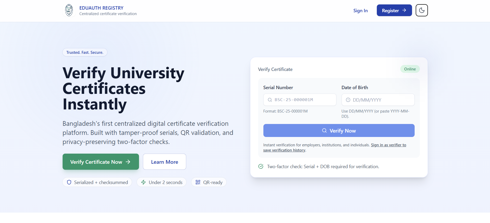
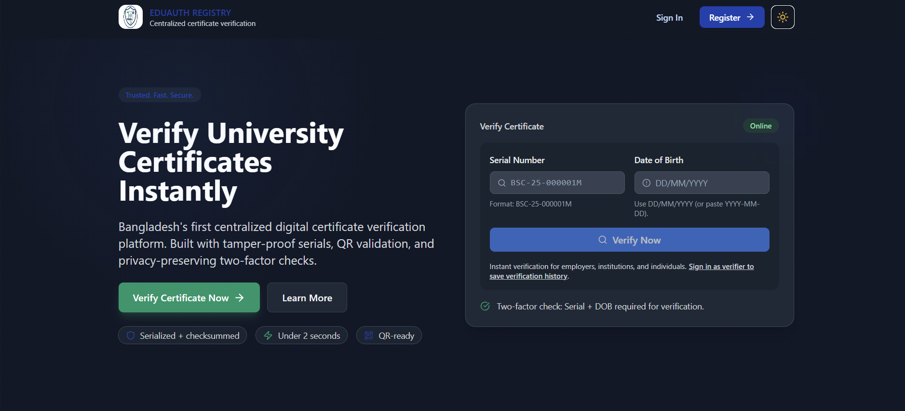
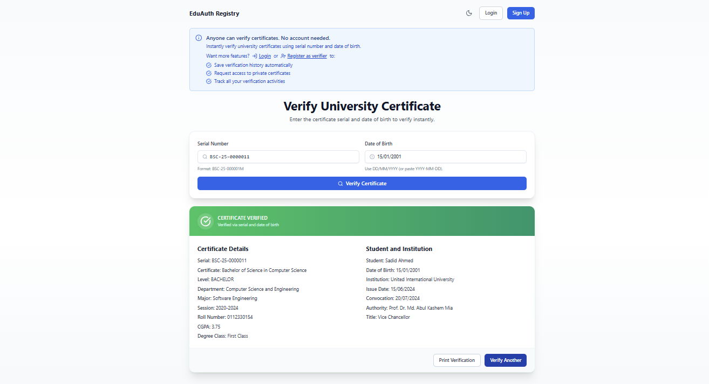
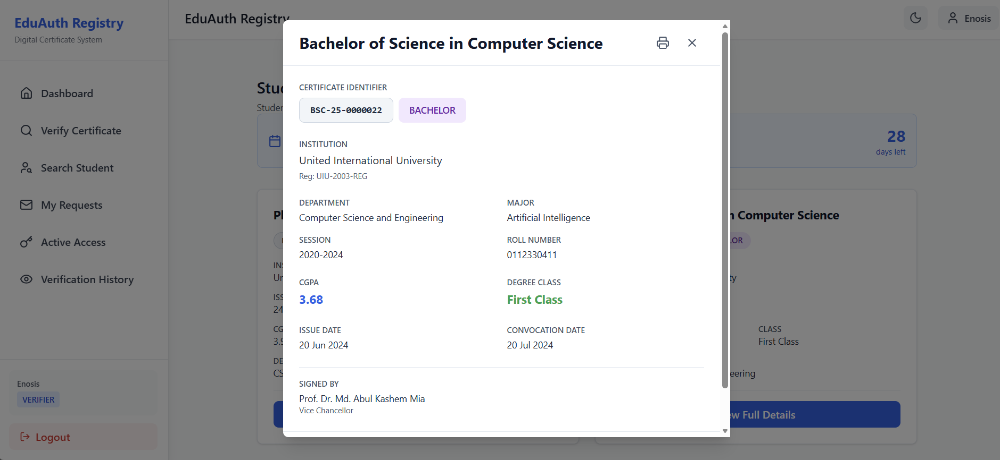
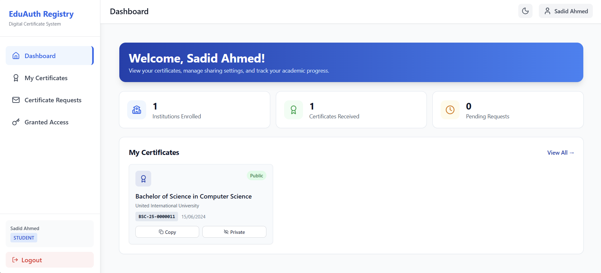
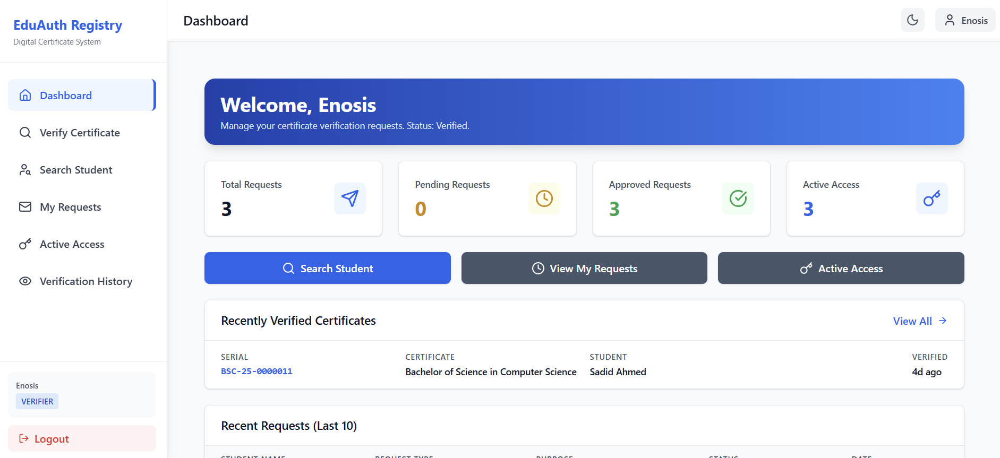
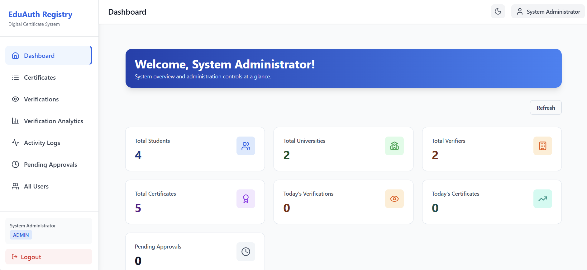
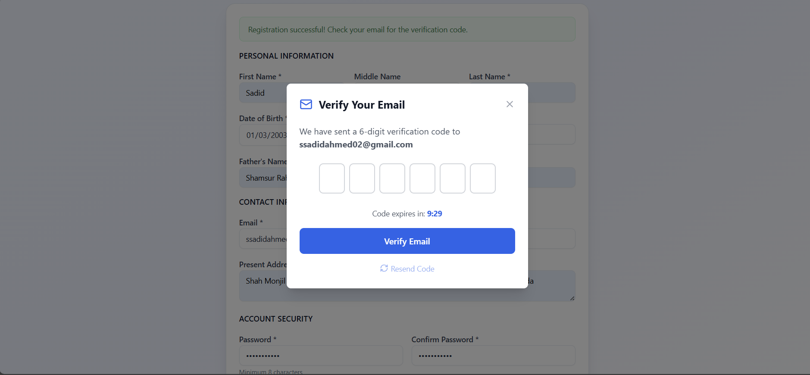
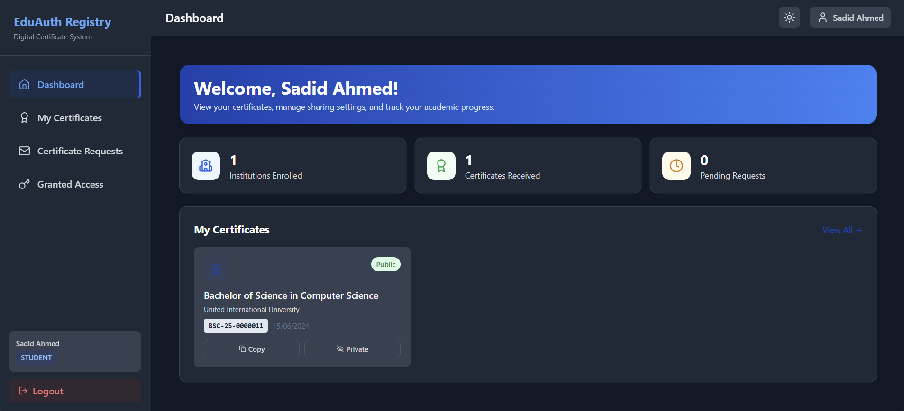

# EduAuth Registry

[](https://opensource.org/licenses/MIT)
[](https://nodejs.org/)
[](https://reactjs.org/)

## 📖 Overview

EduAuth Registry is a comprehensive digital certificate issuance and verification system designed for Bangladeshi universities. This full-stack web application enables universities to issue tamper-proof digital certificates, students to manage their credentials and access requests, employers/verifiers to search and verify student qualifications, and administrators to oversee the entire system with analytics and audit trails.

The system emphasizes database design quality, normalization, data integrity, security, and professional UI/UX. With features like transaction-safe serial generation, two-factor verification, and privacy-preserving design, EduAuth Registry sets the standard for secure educational credential management.

## 📚 Documentation

- Full API reference: [docs/API.md](docs/API.md)
- Database schema & ER diagram: [docs/DATABASE_SCHEMA.md](docs/DATABASE_SCHEMA.md)


## 📸 Screenshots

### Landing Page
<table>
  <tr>
    <td width="50%">
      
      <p align="center"><b>Light Mode</b></p>
    </td>
    <td width="50%">
      
      <p align="center"><b>Dark Mode</b></p>
    </td>
  </tr>
</table>


### Core Functionality
<table>
  <tr>
    <td width="50%">
      
      <p align="center"><b>Public Certificate Verification</b></p>
    </td>
    <td width="50%">
      
      <p align="center"><b>Certificate Details</b></p>
    </td>
  </tr>
</table>

### User Dashboards
<table>
  <tr>
    <td width="50%">
      
      <p align="center"><b>Student Dashboard</b></p>
    </td>
    <td width="50%">
      
      <p align="center"><b>University Dashboard</b></p>
    </td>
  </tr>
  <tr>
    <td width="50%">
      
      <p align="center"><b>Verifier Dashboard</b></p>
    </td>
    <td width="50%">
      
      <p align="center"><b>Admin Dashboard</b></p>
    </td>
  </tr>
</table>

### User Experience Features
<table>
  <tr>
    <td width="50%">
      
      <p align="center"><b>Email Verification System</b></p>
    </td>
    <td width="50%">
      
      <p align="center"><b>Dark Mode Support</b></p>
    </td>
  </tr>
</table>

---

> **Admin Verification Flow:** After email verification, admin approval is required (manual verification of user details through admin dashboard). The system is designed to work without external APIs for maximum reliability.


## ✨ Features

- 🔐 **Secure Authentication** - JWT-based authentication with bcrypt password hashing (12 rounds)
- 📧 **Email Verification System** - 6-digit OTP codes for account verification and admin approvals
- 🔗 **Automated Notifications** - Email alerts for important system events

## 🏗️ System Architecture

- **Frontend:** React 18, React Router v6, Tailwind CSS v3, Axios, date-fns
- **Backend:** Node.js, Express.js, MySQL2 connection pool
- **Database:** MySQL 8.0 with 12 normalized tables and 6 optimized views
- **Authentication:** JWT with 7-day expiration, bcrypt (12 rounds)
- **Email Service:** Nodemailer with Gmail SMTP support
- **Storage:** UUID v4 for all primary keys, InnoDB storage engine

## 🚀 Getting Started

### Prerequisites

- **Node.js** v18.0.0 or higher ([Download](https://nodejs.org/))
- **MySQL 8.0** ([Download](https://dev.mysql.com/downloads/mysql/) or use XAMPP/WAMP)
- **npm** or **yarn** (comes with Node.js)
- **Git** (optional, for cloning)

### Installation

#### 1. Clone the Repository

```bash
git clone https://github.com/litch07/eduauth-registry.git
cd eduauth-registry
```

#### 2. Backend Setup

```bash
cd backend
npm install
cp .env.example .env
# Edit .env with your database and email credentials
```

#### 3. Database Setup

Import the schema using phpMyAdmin or command line:

```bash
# Using command line
mysql -u root -p eduauth_registry < database/schema.sql

# Or use phpMyAdmin to import database/schema.sql
```

Optional: Seed demo data
```bash
cd backend
node seed-demo.js
```

#### 4. Frontend Setup

```bash
cd ../frontend
npm install
```

#### 5. Run the Application

Open two terminals:

**Terminal 1 - Backend (from `backend/` directory):**
```bash
npm run dev
# Runs on http://localhost:5000
```

**Terminal 2 - Frontend (from `frontend/` directory):**
```bash
npm start
# Runs on http://localhost:3000
```

#### 6. Access the Application

- 🌐 **Frontend:** http://localhost:3000
- 🔌 **Backend API:** http://localhost:5000
- 📊 **phpMyAdmin:** http://localhost/phpmyadmin (if using XAMPP)

## 🔑 Default Credentials

After seeding demo data, use these credentials to login:

| Role | Email | Password |
|------|-------|----------|
| Admin | eduauthregistry@gmail.com | admin123 |
| Student 1 (Sadid) | ssadidahmed01@gmail.com | password123 |
| Student 2 (Sayem) | sayem23cse@gmail.com | password123 |
| Student 3 (Rayhan) | mhossain2330996@bscse.uiu.ac.bd | password123 |
| University 1 (UIU) | demo@uiu.ac.bd | password123 |
| University 2 (GUB) | registry@green.edu.bd | password123 |
| Verifier 1 (Enoisis) | ssadidahmed07@gmail.com | password123 |
| Verifier 2 (Tesla) | ssadidahmed03@gmai.com | password123 |

> **Note:** Change these credentials in production!

## 📁 Project Structure

```
eduauth-registry/
├── backend/
│   ├── src/
│   │   ├── config/               # Database & email configuration
│   │   │   ├── database.js       # MySQL connection pool
│   │   │   └── email.js          # Nodemailer setup
│   │   ├── controllers/          # Business logic for each feature
│   │   │   ├── authController.js
│   │   │   ├── studentController.js
│   │   │   ├── universityController.js
│   │   │   ├── verifierController.js
│   │   │   ├── verifyController.js
│   │   │   ├── adminController.js
│   │   │   └── profileController.js
│   │   ├── middleware/           # Authentication & authorization
│   │   │   └── auth.js           # JWT verification, role checking
│   │   ├── routes/               # API endpoint definitions
│   │   │   ├── authRoutes.js
│   │   │   ├── studentRoutes.js
│   │   │   ├── universityRoutes.js
│   │   │   ├── verifierRoutes.js
│   │   │   ├── adminRoutes.js
│   │   │   ├── verifyRoutes.js
│   │   │   └── profileRoutes.js
│   │   ├── utils/                # Helper functions
│   │   │   ├── serialGenerator.js
│   │   │   ├── activityLogger.js
│   │   │   └── emailService.js
│   │   └── server.js             # Express app entry point
│   ├── uploads/                  # User-uploaded files
│   │   ├── certificates/
│   │   ├── students/
│   │   └── universities/
│   ├── .env.example              # Environment variables template
│   ├── package.json
│   └── seed-demo.js              # Demo data generator
├── frontend/
│   ├── src/
│   │   ├── components/           # Reusable React components
│   │   │   ├── DarkModeToggle.jsx
│   │   │   ├── DashboardLayout.jsx
│   │   │   ├── EmailVerificationModal.jsx
│   │   │   ├── Sidebar.jsx
│   │   │   ├── TopHeader.jsx
│   │   │   ├── PageHeader.jsx
│   │   │   └── ...
│   │   ├── context/              # Global state management
│   │   │   ├── AuthContext.jsx
│   │   │   └── DarkModeContext.jsx
│   │   ├── pages/                # Page components by role
│   │   │   ├── Landing.jsx
│   │   │   ├── Login.jsx
│   │   │   ├── Verify.jsx
│   │   │   ├── student/
│   │   │   ├── university/
│   │   │   ├── verifier/
│   │   │   └── admin/
│   │   ├── services/             # API client & configuration
│   │   │   └── api.js            # Axios instance
│   │   ├── App.js                # Main app component
│   │   └── index.js              # React entry point
│   ├── public/
│   ├── tailwind.config.js        # Tailwind CSS configuration
│   ├── package.json
│   └── ...
├── database/
│   ├── schema.sql                # Complete database schema
│   └── seed.sql                  # Demo data SQL
├── docs/                         # Documentation files
│   ├── API.md                    # Detailed API documentation
│   ├── DATABASE_SCHEMA.md        # ER diagram & schema details
│   └── SETUP.md                  # Detailed setup guide
├── .gitignore
├── LICENSE
├── CONTRIBUTING.md
├── SETUP.md
└── README.md
```

## 🔐 Environment Variables

Create a `.env` file in the `backend/` directory with the following variables:

```env
# ===== SERVER CONFIGURATION =====
PORT=5000
NODE_ENV=development
FRONTEND_URL=http://localhost:3000

# ===== DATABASE CONFIGURATION =====
DB_HOST=localhost
DB_USER=root
DB_PASSWORD=
DB_NAME=eduauth_registry
DB_PORT=3306

# ===== JWT CONFIGURATION =====
JWT_SECRET=your-super-secret-jwt-key-change-in-production
JWT_EXPIRES_IN=7d

# ===== EMAIL CONFIGURATION (Gmail) =====
SMTP_HOST=smtp.gmail.com
SMTP_PORT=587
SMTP_USER=your-email@gmail.com
SMTP_PASS=your-app-password
SMTP_FROM=EduAuth Registry <noreply@eduauth.com>
```

### Gmail App Password Setup

1. Enable 2-Factor Authentication on your Gmail account
2. Generate an [App Password](https://myaccount.google.com/apppasswords)
3. Use the generated password in `SMTP_PASS`

## 📚 API Documentation

### Public Endpoints (No Authentication)

#### Certificate Verification
- `POST /api/verify/certificate` - Verify certificate using Serial + DOB
  ```json
  {
    "serial": "BSC-25-000001M",
    "dateOfBirth": "2000-01-15"
  }
  ```

### Authentication Endpoints

#### User Registration & Login
- `POST /api/auth/register/student` - Register as student
- `POST /api/auth/register/university` - Register as university (requires admin approval)
- `POST /api/auth/register/verifier` - Register as verifier (requires admin approval)
- `POST /api/auth/login` - Login (Student, University, or Verifier)
- `POST /api/auth/send-verification-code` - Send email verification code
- `POST /api/auth/verify-email-code` - Verify email with 6-digit code

### Student Protected Routes

- `GET /api/student/dashboard` - Dashboard statistics
- `GET /api/student/certificates` - Get student's certificates
- `PUT /api/student/certificates/:id/toggle-sharing` - Toggle certificate privacy
- `GET /api/student/certificate-requests` - View access requests
- `PUT /api/student/certificate-requests/:id/approve` - Approve request
- `PUT /api/student/certificate-requests/:id/reject` - Reject request

### University Protected Routes

- `GET /api/university/dashboard` - Dashboard statistics
- `GET /api/university/students` - List enrolled students
- `POST /api/university/students/enroll` - Enroll new student
- `GET /api/university/students/search` - Search students by email
- `POST /api/university/certificates/issue` - Issue new certificate

### Verifier Protected Routes

- `GET /api/verifier/dashboard` - Dashboard statistics
- `GET /api/verifier/search-student` - Search by NID + DOB
- `POST /api/verifier/request-all-certificates` - Request access to all certificates
- `POST /api/verifier/request-single-certificate` - Request access to specific certificate
- `GET /api/verifier/my-requests` - View sent requests
- `GET /api/verifier/active-access` - View active access grants
- `GET /api/verifier/verification-history` - View verification history

### Admin Protected Routes

- `GET /api/admin/dashboard` - System statistics
- `GET /api/admin/pending-verifiers` - Pending verifier approvals
- `PUT /api/admin/verifiers/:id/approve` - Approve verifier
- `PUT /api/admin/verifiers/:id/reject` - Reject verifier
- `GET /api/admin/users` - List all users
- `GET /api/admin/verification-analytics` - Verification statistics
- `GET /api/admin/activity-logs` - System activity logs

**For detailed API documentation, see [API.md](docs/API.md)**

## 🗄️ Database Schema

### 12 Normalized Tables (3NF)

**Core User Tables:**
- `Admins` - System administrators
- `Users` - All user accounts (STUDENT, UNIVERSITY, VERIFIER)
- `Student` - Student profile information
- `Institution` - University/institution profiles
- `Verifiers` - Employer/organization verifier profiles

**Operational Tables:**
- `Enrollment` - Links students to institutions
- `Certificate` - Issued certificates with serial numbers
- `CertificateSequence` - Singleton table for safe serial generation

**Request & Access Tables:**
- `CertificateRequests` - Verifier requests for access
- `VerifierAccess` - Active access grants

**Audit Tables:**
- `VerificationLog` - Public certificate verification audit trail
- `ActivityLog` - System-wide activity audit
- `EmailVerificationCodes` - Email verification OTP codes

### 6 Database Views (Performance Optimization)

- `vw_certificates_full` - Certificate with student and institution details
- `vw_student_dashboard` - Student statistics
- `vw_university_dashboard` - University statistics
- `vw_verification_stats` - Verification statistics per certificate
- `vw_active_enrollments` - Complete enrollment information
- `vw_system_stats` - System-wide metrics

**For detailed ER diagram and schema, see [DATABASE_SCHEMA.md](docs/DATABASE_SCHEMA.md)**

## 🔒 Security Features

### Authentication & Authorization
- ✅ **JWT Authentication** - 7-day token expiration
- ✅ **bcrypt Password Hashing** - 12 rounds with salt
- ✅ **Role-Based Access Control (RBAC)** - Fine-grained permissions
- ✅ **Email Verification** - 6-digit OTP codes

### Data Protection
- ✅ **SQL Injection Prevention** - All queries parameterized
- ✅ **Soft Delete** - Data retention with logical deletion
- ✅ **Complete Audit Trail** - ActivityLog for all actions
- ✅ **Privacy Protection** - Sensitive data never exposed in APIs

### Verification & Privacy
- ✅ **Two-Factor Verification** - Serial + Date of Birth
- ✅ **Admin Approval Workflow** - Universities and verifiers require approval
- ✅ **Privacy-Preserving Search** - NID search doesn't expose personal data
- ✅ **Student Control** - Can toggle certificate sharing and revoke access

## 🎨 Key Features Explained

### Certificate Serial Format

Each certificate has a unique, tamper-proof serial number: `BSC-25-000001M`

- **BSC** - Degree level (BSC/MSC/PHD)
- **25** - Year (2025)
- **000001** - Base-36 sequence number (6 characters, auto-incrementing)
- **M** - Checksum digit (validates sequence using weighted modulo-36)

### Transaction-Safe Serial Generation

The system prevents duplicate serials using:
- `SELECT ... FOR UPDATE` - Row-level locking
- `CertificateSequence` - Singleton table for atomic increments
- Transaction rollback on failure

This ensures data integrity even under concurrent issuance.

### Two-Factor Verification

Public certificate verification requires two independent factors:
1. **Certificate Serial Number** - Public identifier
2. **Student Date of Birth** - Private credential

This prevents unauthorized access while maintaining privacy.

### Admin Approval System

New universities and verifiers require admin approval:
1. User registers with details
2. Admin reviews in pending approvals
3. Admin approves (sends email) or rejects with reason
4. User can now use the system (if approved)

## 🧪 Testing

### Test with Postman/Insomnia

1. Import the API collection (if available)
2. Set environment variables (BASE_URL, JWT_TOKEN)
3. Run test requests

### Test with Demo Data

```bash
cd backend
node seed-demo.js
```

This creates:
- 1 Admin account (eduauthregistry@gmail.com)
- 2 Universities (UIU and GUB, both pre-approved)
- 3 Students (Sadid, Sayem, Rayhan with enrollments)
- 2 Verifiers (Enoisis and Tesla, both pre-approved)
- 3 Certificates with different degree levels
- Sample verification history and activity logs

## 🤝 Contributing

This is an academic DBMS Lab project. Contributions are welcome!

1. **Fork** the repository
2. **Create** a feature branch (`git checkout -b feature/AmazingFeature`)
3. **Commit** your changes (`git commit -m 'Add AmazingFeature'`)
4. **Push** to branch (`git push origin feature/AmazingFeature`)
5. **Open** a Pull Request

Please see [CONTRIBUTING.md](CONTRIBUTING.md) for guidelines.

## 📝 License

This project is licensed under the **MIT License** - see the [LICENSE](LICENSE) file for details.

## 👨‍💻 Authors

- **Your Name** - *Initial work* - [GitHub Profile](https://github.com/YOUR-USERNAME)

## 🙏 Acknowledgments

- Built as a **DBMS Lab** project for database design excellence
- Inspired by secure educational credential systems
- Thanks to all contributors and reviewers

## 📞 Support

For support, questions, or bug reports:
- 📧 Email: your-email@example.com
- 🐛 Open an [Issue](https://github.com/litch07/eduauth-registry/issues)
- 💬 Discuss in [Discussions](https://github.com/litch07/eduauth-registry/discussions)

## 🔗 Quick Links

- 📖 [Full Documentation](docs/)
- 🗄️ [Database Schema](docs/DATABASE_SCHEMA.md)
- 📚 [API Reference](docs/API.md)
- 🛠️ [Setup Guide](SETUP.md)
- 📋 [Contributing Guidelines](CONTRIBUTING.md)

## 🌟 Project Highlights

### Database Design
- ✅ 3NF normalization
- ✅ 12 normalized tables
- ✅ 6 optimized views
- ✅ Complete integrity constraints
- ✅ Comprehensive indexing

### Code Quality
- ✅ Clean, maintainable code
- ✅ Consistent naming conventions
- ✅ Proper error handling
- ✅ Security best practices
- ✅ Well-documented

### User Experience
- ✅ Professional UI design
- ✅ Responsive layout
- ✅ Dark mode support
- ✅ Intuitive navigation
- ✅ Clear error messages

---

**⭐ If you find this project useful, please consider giving it a star!**

Made with ❤️ for academic excellence.
