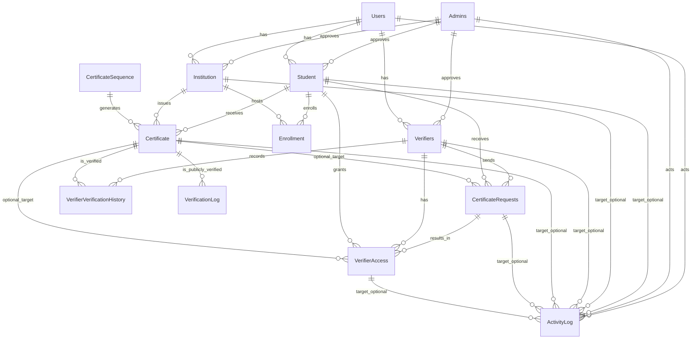

# EduAuth Registry — Database Schema Guide

This document provides a visual ER diagram, table descriptions, relationships, indexing strategy, database views, and example queries for the EduAuth Registry.

## 1) ER Diagram



Notes:
- Soft delete applies to Users, Student, Institution, Verifiers, Enrollment, Certificate.
- ActivityLog uses `actorType` and `targetType` for polymorphic references (not strict FKs).

---

## 2) Table Descriptions

### Admins
- Purpose: System administrators who approve institutions, students (optional), and verifiers.
- Key columns: `id (UUID, PK)`, `email (UNIQUE)`, `password`, `name`, `createdAt`, `updatedAt`.

### Users
- Purpose: Authentication identities for Student, Institution, and Verifier roles.
- Key columns: `id (UUID, PK)`, `email (UNIQUE)`, `password (bcrypt)`, `role (ENUM: STUDENT|UNIVERSITY|VERIFIER)`, `emailVerified (BOOL)`, `deletedAt`, `deletedBy`, timestamps.

### Student
- Purpose: Student profile and personal information.
- Key columns: `id (UUID, PK)`, `userId (FK Users)`, `firstName`, `middleName`, `lastName`, `dateOfBirth`, `nid`, `fatherName`, `motherName`, `phone`, `presentAddress`, `studentId`, approval fields: `isApproved`, `approvedAt`, `approvedBy (FK Admins)`, `rejectionReason`, soft delete fields + timestamps.

### Institution
- Purpose: University or institution profile.
- Key columns: `id (UUID, PK)`, `userId (FK Users)`, `name`, `registrationNumber`, `establishedYear`, `phone`, `address`, `website`, `authorityName`, `authorityTitle`, approval fields: `isApproved`, `approvedAt`, `approvedBy (FK Admins)`, `rejectionReason`, soft delete + timestamps.

### Verifiers
- Purpose: Verifier organizations (employers, agencies) who request access.
- Key columns: `id (UUID, PK)`, `userId (FK Users)`, `companyName`, `companyRegistration`, `website`, `contactPhone`, `purpose`, approval fields: `isApproved`, `approvedAt`, `approvedBy (FK Admins)`, soft delete + timestamps.

### Enrollment
- Purpose: Link between `Student` and `Institution` with academic context.
- Key columns: `id (UUID, PK)`, `studentId (FK Student)`, `institutionId (FK Institution)`, `studentInstitutionId`, `enrollmentDate`, `department`, `session`, `IDNumber`, soft delete + timestamps.

### Certificate
- Purpose: Issued certificate records.
- Key columns: `id (UUID, PK)`, `serial (UNIQUE)`, `sequenceNumber`, `studentId (FK Student)`, `institutionId (FK Institution)`, `certificateLevel`, `certificateName`, `department`, `major`, `session`, `IDNumber`, `cgpa`, `degreeClass`, `issueDate`, `convocationDate`, `authorityName`, `authorityTitle`, `isPubliclyShareable (BOOL)`, soft delete + timestamps.

### CertificateSequence
- Purpose: Singleton counter for safe serial generation.
- Key columns: `id (PK, INT or UUID; often 1)`, `lastSequence`, `updatedAt`.

### CertificateRequests
- Purpose: Verifier requests for certificate access.
- Key columns: `id (UUID, PK)`, `requestType (ENUM: ALL_CERTIFICATES|SINGLE_CERTIFICATE)`, `verifierId (FK Verifiers)`, `studentId (FK Student)`, `certificateId (FK Certificate, nullable)`, `purpose`, `reason`, `status (ENUM: PENDING|APPROVED|REJECTED|EXPIRED)`, `expiresAt`, `approvedAt`, `rejectedAt`, `rejectionReason`, `createdAt`.

### VerifierAccess
- Purpose: Active access grants issued after approval.
- Key columns: `id (UUID, PK)`, `requestId (FK CertificateRequests)`, `verifierId (FK Verifiers)`, `studentId (FK Student)`, `certificateId (FK Certificate, nullable)`, `grantedAt`, `expiresAt`, `revokedAt`, `revokedReason`, `createdAt`.

### VerifierVerificationHistory
- Purpose: Track certificates verified by logged-in verifiers (separate from public verification).
- Key columns: `id (UUID, PK)`, `verifierId (FK Verifiers)`, `certificateId (FK Certificate)`, `verifiedAt`.

### VerificationLog
- Purpose: Public certificate verification audit trail (immutable).
- Key columns: `id (UUID, PK)`, `certificateId (FK Certificate)`, `verifierIP`, `verifierCountry`, `verifierUserAgent`, `verifiedAt`.

### ActivityLog
- Purpose: System-wide activity audit trail (immutable).
- Key columns: `id (UUID, PK)`, `actorId`, `actorType (ENUM: STUDENT|UNIVERSITY|ADMIN|VERIFIER|SYSTEM)`, `action`, `targetType`, `targetId`, `details (JSON)`, `ipAddress`, `createdAt`.

---

## 3) Relationships (FK Summary)
- `Student.userId` → `Users.id`
- `Institution.userId` → `Users.id`
- `Verifiers.userId` → `Users.id`
- `Student.approvedBy` → `Admins.id`
- `Institution.approvedBy` → `Admins.id`
- `Verifiers.approvedBy` → `Admins.id`
- `Enrollment.studentId` → `Student.id`
- `Enrollment.institutionId` → `Institution.id`
- `Certificate.studentId` → `Student.id`
- `Certificate.institutionId` → `Institution.id`
- `CertificateRequests.verifierId` → `Verifiers.id`
- `CertificateRequests.studentId` → `Student.id`
- `CertificateRequests.certificateId` → `Certificate.id (nullable)`
- `VerifierAccess.requestId` → `CertificateRequests.id`
- `VerifierAccess.verifierId` → `Verifiers.id`
- `VerifierAccess.studentId` → `Student.id`
- `VerifierAccess.certificateId` → `Certificate.id (nullable)`
- `VerifierVerificationHistory.verifierId` → `Verifiers.id`
- `VerifierVerificationHistory.certificateId` → `Certificate.id`
- `VerificationLog.certificateId` → `Certificate.id`

Note: `ActivityLog` uses polymorphic references via `actorType/targetType`; maintain logical referential integrity at the application layer.

---

## 4) Indexes & Performance

### Mandatory Indexes
- `Users.email` (UNIQUE)
- `Certificate.serial` (UNIQUE)
- All FK columns should have indexes: 
  - `Student.userId`, `Institution.userId`, `Verifiers.userId`
  - `Enrollment.studentId`, `Enrollment.institutionId`
  - `Certificate.studentId`, `Certificate.institutionId`
  - `CertificateRequests.verifierId`, `studentId`, `certificateId`
  - `VerifierAccess.requestId`, `verifierId`, `studentId`, `certificateId`
  - `VerifierVerificationHistory.verifierId`, `certificateId`
  - `VerificationLog.certificateId`

### Recommended Composite Indexes
- `Enrollment (institutionId, department, session)` — frequent filtering
- `CertificateRequests (verifierId, status, createdAt)` — list screens
- `VerifierAccess (verifierId, expiresAt)` — active/expired views
- `Certificate (institutionId, issueDate)` — admin/university dashboards

### Other Considerations
- Use InnoDB (transactions, row-level locking)
- utf8mb4 + utf8mb4_unicode_ci for full Unicode
- Soft delete pattern: always filter `WHERE deletedAt IS NULL`

---

## 5) Database Views

### vw_certificates_full
- Purpose: Certificate joined with student and institution details; excludes soft-deleted rows.
- Typical columns: `certificateId, serial, certificateName, certificateLevel, studentId, studentFullName, institutionId, institutionName, issueDate, cgpa, degreeClass`.
- Used by: Public verification, certificate display.

### vw_student_dashboard
- Purpose: Pre-calculated student metrics.
- Returns: `studentId, userId, studentName, totalEnrollments, totalCertificates, pendingRequests`.
- Used by: Student dashboard screen.

### vw_university_dashboard
- Purpose: Pre-calculated university metrics.
- Returns: `institutionId, userId, universityName, totalStudents, totalCertificates, todayCertificates`.
- Used by: University dashboard.

### vw_verification_stats
- Purpose: Aggregated verification stats per certificate.
- Returns: `certificateId, serial, certificateName, totalVerifications, uniqueCountries, lastVerifiedAt, todayVerifications`.
- Used by: Admin analytics.

### vw_active_enrollments
- Purpose: Enrollment joined with student and institution + certificate count.
- Returns: `enrollmentId, studentInstitutionId, enrollmentDate, department, session, studentId, studentName, studentEmail, institutionId, certificatesIssued`.
- Used by: University student management.

### vw_system_stats
- Purpose: System-wide metrics.
- Returns: `totalStudents, totalUniversities, totalVerifiers, totalCertificates, todayCertificates, todayVerifications, totalVerifications, pendingCertRequests, pendingVerifiers, newUsersThisWeek`.
- Used by: Admin dashboard.

---

## 6) Example Queries

### A) Public Verification via View
```sql
SELECT *
FROM vw_certificates_full
WHERE serial = ?; -- e.g., 'BSC-25-0000011'
```

### B) Student Lookup by NID + DOB (Verifier search)
```sql
SELECT s.id AS studentId, s.firstName, s.lastName,
       (SELECT COUNT(*) FROM Certificate c WHERE c.studentId = s.id AND c.deletedAt IS NULL) AS totalCertificates
FROM Student s
JOIN Users u ON u.id = s.userId
WHERE s.nid = ? AND s.dateOfBirth = ? AND s.deletedAt IS NULL; -- parameters: nid, 'YYYY-MM-DD'
```

### C) Transaction-Safe Serial Generation (Issuance)
```sql
-- Within a transaction using SELECT ... FOR UPDATE
SELECT lastSequence
FROM CertificateSequence
WHERE id = 1
FOR UPDATE;

-- Application generates serial: <DEG>-<YY>-<SEQ6>[checksum]
-- Then updates the counter
UPDATE CertificateSequence
SET lastSequence = lastSequence + 1
WHERE id = 1;

-- Finally inserts the certificate
INSERT INTO Certificate (
  id, serial, sequenceNumber, certificateLevel, certificateName,
  studentId, institutionId, department, major, session, IDNumber,
  cgpa, degreeClass, issueDate, convocationDate, authorityName, authorityTitle,
  isPubliclyShareable, createdAt
) VALUES (?, ?, ?, ?, ?, ?, ?, ?, ?, ?, ?, ?, ?, ?, ?, ?, ?, ?, NOW());
```

### D) Active Access Validation (Verifier can view?)
```sql
SELECT 1
FROM VerifierAccess va
WHERE va.verifierId = ?
  AND va.studentId = ?
  AND (va.certificateId IS NULL OR va.certificateId = ?)
  AND va.revokedAt IS NULL
  AND va.expiresAt > NOW();
```

### E) Admin Verification Analytics via View
```sql
SELECT serial, certificateName, totalVerifications, uniqueCountries, lastVerifiedAt
FROM vw_verification_stats
ORDER BY totalVerifications DESC
LIMIT 20;
```

### F) University Dashboard — Today Certificates
```sql
SELECT COUNT(*) AS todayCertificates
FROM Certificate
WHERE institutionId = ?
  AND issueDate = CURDATE()
  AND deletedAt IS NULL;
```

---

## Notes & Conventions
- Always use parameterized queries.
- Filter soft-deleted rows (`WHERE deletedAt IS NULL`).
- Respect role-based access control at the application layer.
- For polymorphic logs, include `actorType/targetType` in queries.

This schema is aligned with the implemented controllers and the demo seed data in `database/seed.sql`.
